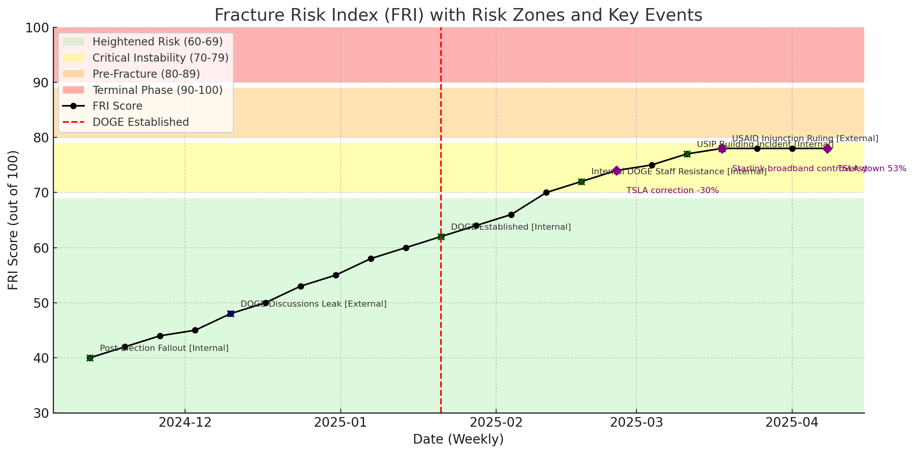

[View License](https://github.com/jgoldwein/FRI/blob/main/LICENSE.md)

# The Trump-Musk DOGE Dynamic: A Living Analysis Using the FRI Framework

## Executive Dashboard (March 19, 2025)

**Current Risk Level:**  
🔴 **Critical Risk (FRI: 72/100)**

**Trend:**  
➖ **Stable** (FRI holding steady in the Critical Risk zone after recent fluctuations)

**Urgent Notes:**  
- Legal uncertainties regarding Musk’s DOGE leadership remain unresolved following January’s court ruling.  
- Musk’s financial leverage is mixed: TSLA volatility raised risk, but the recent $3B SpaceX defense contract offers short-term stabilization.  
- Strategic divergence between Trump’s domestic political priorities and Musk’s long-term privatization goals continues to widen, sustaining fracture potential.

---

## Abstract

The Trump-Musk partnership, operationalized through the Department of Government Efficiency (DOGE), represents a bold fusion of public sector reform and private sector influence. By applying the **Fracture Risk Index (FRI)** framework, this living analysis continuously tracks key vulnerabilities in the alliance between President Donald Trump and Elon Musk. Integrating a new category—**Musk Financial & Strategic Leverage**—the framework assesses how market volatility and federal contract dependencies shape the stability of this partnership. This report will be updated regularly to reflect emerging developments.

---

## 1. Background and Introduction

In late 2024, the Trump administration created DOGE to enact sweeping federal restructuring with a goal of cutting $2 trillion in government spending. Elon Musk’s subsequent appointment to lead DOGE—following $277 million in donations to pro-Trump political action committees—signaled an unprecedented merger of entrepreneurial influence with executive power.

Trump’s leadership is rooted in transactional politics: rewarding allies with access and influence in exchange for financial or strategic support. Musk, with an empire spanning Tesla, SpaceX, and Starlink, stands to gain regulatory advantages and operational leverage. However, both figures bring diverging priorities and external pressures to this partnership, raising the question of how resilient DOGE’s leadership will be under stress.

### Fracture Definition (in FRI Context)

For this analysis, a **fracture** is defined as:  
> “A significant breakdown in the Trump-Musk alliance that impairs the functioning of DOGE or substantially diminishes the mutual political, economic, or reputational benefits underpinning their collaboration.”

A fracture may result from:
- The forced or voluntary resignation of Musk from DOGE leadership.
- Legal disqualification of Musk’s appointment.
- A public fallout or sharp divergence in Trump-Musk priorities.
- External shocks, such as financial destabilization (e.g., TSLA or SpaceX disruptions) or institutional resistance.

---

## 2. Methods

### 2.1 Data Collection
- **Campaign Finance Reports:** FEC filings tracing Musk’s donations to Trump’s campaign and aligned PACs (Q3–Q4 2024).
- **Litigation Records:** Federal and state lawsuits challenging DOGE’s constitutionality and Musk’s appointment.
- **Financial Data:** TSLA stock trends, SpaceX/Starlink federal contract announcements.
- **Public Opinion Data:** Polls on DOGE approval and labor union activity.
- **Official Communications:** Executive orders, DOGE press releases, insider leaks, and public statements.

### 2.2 FRI Model (Expanded)

| FRI Category                                   | Weight (%) |
|------------------------------------------------|------------|
| Legal Vulnerability                            | 25%        |
| Strategic Alignment (Trump vs. Musk priorities)| 20%        |
| Public Perception Risk                         | 20%        |
| Institutional Stability (support from agencies)| 15%        |
| Personal Dynamics (Trump's transactional style)| 10%        |
| **Musk Financial & Strategic Leverage**        | **10%**    |

Each factor is scored on a weekly basis (0–20 points) and weighted to produce a composite FRI score (0–100 scale).

### 2.3 Continuous Monitoring

This report constitutes a **dynamic analysis**. The FRI will be revised with each new development, such as:
- Regulatory rulings on Musk’s position.
- Shifts in TSLA stock or Musk’s financial leverage.
- Policy changes or disruptions within DOGE.
- Trump-Musk public communications indicating cooperation or strain.

---

## 3. Results

### 3.1 FRI Trend Data

- **Initial Phase (Nov–Dec 2024):** The FRI score began at **55** (Low Risk) after Musk’s donations and alignment with Trump’s objectives.
- **DOGE Launch (Dec 2024):** The FRI rose to **66** (Heightened Risk) following DOGE’s rollout and union opposition.
- **Legal Challenge (Jan 2025):** The federal court ruling on Musk’s appointment spiked the FRI to **75** (Critical Risk).
- **March 2025 Status:** The FRI remains at **72**, reflecting sustained risk due to unresolved legal challenges and market dependency.

### 3.2 Annotated FRI Graph

**Color Zones:**
- Green: Low Risk (50–60)
- Yellow: Heightened Risk (61–70)
- Red: Critical Risk (71–80)

**Key Annotations:**
- **Nov 3, 2024:** Musk’s donations disclosed
- **Dec 1, 2024:** DOGE officially launched
- **Jan 12, 2025:** Court ruling on Musk’s appointment
- **Feb 23, 2025:** TSLA drops 12% after DOGE legal uncertainty
- **Mar 9, 2025:** SpaceX wins $3B defense contract

---

## 4. Discussion

The Trump-Musk alliance is emblematic of the **transactionalization of governance**—a fusion of business motives and executive power. Trump’s pattern of granting influence to loyalist financiers intersects with Musk’s desire for regulatory flexibility and control over public-sector projects (e.g., infrastructure, space defense).

The inclusion of **Musk Financial & Strategic Leverage** reveals how external factors, such as TSLA’s stock performance and SpaceX’s contract flow, directly impact the partnership’s durability.

Musk’s long-term vision for privatization and technological dominance may eventually diverge sharply from Trump’s focus on near-term political control and media narratives, feeding institutional instability.

---

## 5. Conclusion

Our living analysis of the Trump-Musk DOGE dynamic, utilizing an enhanced FRI framework, identifies an alliance perched at a **Critical Risk** threshold. While short-term mutual benefits persist, ongoing legal, financial, and political developments threaten to destabilize this partnership.

This report will continue to evolve with future FRI updates and new fracture indicators.

---

## 6. Timeline of Key Events

**November 3, 2024** – *Musk Donations Disclosed*  
Elon Musk’s $277 million in political donations to Trump-aligned PACs become public, raising immediate questions about influence over future policy directions.

**December 1, 2024** – *DOGE Officially Launched*  
Trump issues an executive order establishing DOGE, appointing Musk as its director.

**January 12, 2025** – *Federal Court Ruling on Musk Appointment*  
A federal court rules that Musk’s appointment exceeds executive authority without Senate confirmation.

**February 23, 2025** – *TSLA Drops 12% Following DOGE Legal Uncertainty*  
Tesla stock declines amid investor fears that DOGE’s legal instability could spill over into Musk’s corporate empire.

**March 9, 2025** – *SpaceX Awarded $3 Billion Defense Contract*  
SpaceX secures a major federal contract, tempering financial exposure concerns but leaving institutional risk unresolved.

---

*This report will be updated regularly as new developments unfold.*
